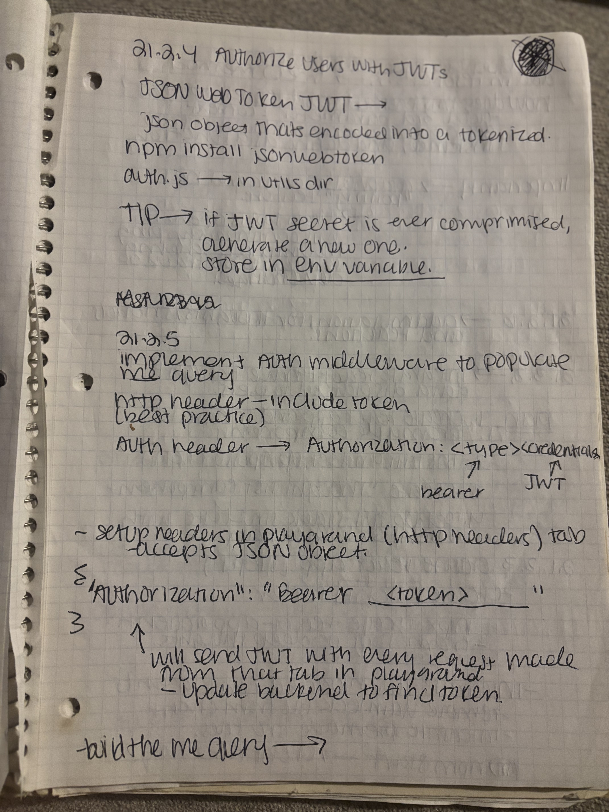
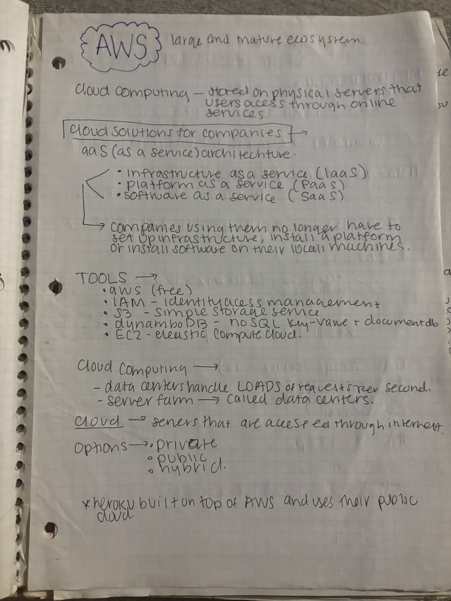

# Auth & Cloud: When Security Became Real (2021)

_The moment I understood that authentication isn't optional_

---

## Context

**When:** 2021 (Bootcamp - Authentication & deployment module)
**What I was learning:** JWT authentication, OAuth, stateless auth patterns, cloud computing with AWS
**Why it was hard:** Authentication seemed simple in theory ("just check if they're logged in") but the implementation was complex. How do you maintain session state without sessions? How do you scale authentication across multiple servers? How do you deploy to the cloud?
**Where I was:** Building full-stack applications and realizing security and deployment are non-negotiable

**The challenge:** Understanding that authentication and authorization aren't the same thing, and both are critical for production applications.

---

## The Notes

These 2 pages capture me learning JWT authentication and cloud deployment: the invisible infrastructure that makes applications secure and scalable.

### Page 1: JWT Authorization Flow


**What's happening here:**
"01.24.4 Authorize users with JWT"

Detailed notes on authorization flow: JWT tokens, bearer tokens, authentication middleware, headers.

**What I notice now:**
**Authentication ≠ Authorization.**
- **Authentication**: Who are you? (Login with credentials, get JWT)
- **Authorization**: What can you do? (Check JWT on protected routes)

The bearer token in the `Authorization` header is how the frontend proves identity on every request. Middleware validates it before allowing access. This was the breakthrough: understanding the flow end-to-end.

---

### Page 2: AWS Cloud Computing


**What's happening here:**
Notes on AWS and cloud computing concepts:
- **IaaS (Infrastructure as a Service)**: Rent servers (EC2)
- **PaaS (Platform as a Service)**: Rent platform (Elastic Beanstalk)
- **SaaS (Software as a Service)**: Rent software

Cloud computing terminology: data centers, server farms, hybrid cloud, public/private cloud.

**What I notice now:**
**Cloud computing is renting compute power instead of buying servers.** You pay for what you use, scale up or down on demand, and someone else manages the hardware. AWS provides the infrastructure; you provide the code. Understanding this made deployment less scary. It's just running your code on someone else's computer.

---

## The Aha Moment

**Page 1: JWT Authorization Flow**

The breakthrough came from understanding the **complete authentication lifecycle**:

```
1. User logs in with username + password
   ↓
2. Server validates credentials
   ↓
3. Server generates JWT token (signed, contains user ID)
   ↓
4. Frontend stores token (localStorage, httpOnly cookie)
   ↓
5. Frontend sends token in Authorization header on every request
   ↓
6. Middleware validates JWT signature
   ↓
7. If valid: allow access. If invalid: 401 Unauthorized.
```

**The key insight: JWTs make authentication stateless.**

Traditional sessions require the server to store "who's logged in" in memory or a database. Every request hits the session store to check validity.

JWTs flip this: **the token itself is proof of authentication.** The server just verifies the signature (using its secret key). No database lookup needed. This scales horizontally. Any server can validate any token.

**But JWTs have a tradeoff:** you can't revoke them before they expire. If a token is compromised, it's valid until expiration. That's why short expiration times matter.

This explained why refresh tokens exist, why logout is tricky with JWTs, and why token security is critical!

---

## How I'd Explain This Now

**Then (2021):**
"JWTs are tokens that keep users logged in."

**Now (2025):**
"JWTs are digitally signed credentials that prove authentication without server-side session storage.

Think of it like a concert wristband:
- **Login** = ticket booth validates your ticket, gives you a wristband
- **Wristband** = JWT token (signed by venue, proves you paid)
- **Re-entry** = show wristband to security (middleware), they verify signature
- **No database check needed** = security doesn't call the ticket booth, they just verify the wristband is legitimate

The wristband (JWT) contains:
- **Header**: Type of token, signing algorithm
- **Payload**: User ID, roles, expiration time
- **Signature**: Cryptographic proof it wasn't tampered with

Benefits:
- Stateless (no session storage)
- Scalable (any server can validate)
- Portable (works across domains)

Tradeoffs:
- Can't revoke before expiration (stolen wristband is valid until concert ends)
- Larger than session IDs (sent on every request)
- Require secure secret key management

This is why you see short expiration times (15 min) paired with refresh tokens (7 days). The JWT expires quickly, limiting damage from theft. The refresh token lives in an httpOnly cookie, used only to get new JWTs.

**Security isn't a feature. It's a requirement built into the architecture.**"

**The wristband metaphor started here**, trying to make JWTs concrete instead of abstract crypto magic.

---

## What This Taught Me

**Backend architecture is about trust boundaries.**

Every API endpoint is a trust boundary: Can I trust this request? Is this user authorized? The backend's job is to validate, authorize, and protect data. Frontend can be manipulated. Backend is the source of truth.

**Authentication is hard to get right.**

It's not just "check username and password." You need:
- Password hashing (bcrypt, never plaintext)
- Token generation and validation
- Secure token storage
- Expiration and refresh logic
- Protection against CSRF, XSS, injection attacks

Understanding JWT auth flow gave me a mental model for every authentication system I'd encounter later.

**Cloud deployment changes everything.**

Before AWS, deployment meant "buy a server, configure it, pray it doesn't crash." After AWS: spin up servers on demand, scale automatically, pay per use. The infrastructure became code (`terraform`, CloudFormation). **Cloud-native thinking** started here.

---

## Connection to Today

The backend concepts from these notes show up everywhere:
- **RESTful API design** (routes map to resources, HTTP methods map to actions)
- **Middleware patterns** (authentication, logging, error handling)
- **JWT in production** (every modern SPA uses token-based auth)
- **Cloud infrastructure** (AWS, Azure, GCP — all follow the same IaaS/PaaS/SaaS model)
- **Zero-trust security** (never trust the client, always validate on the server)

**The instinct to think about security first started here.**

---

_From 2021 bootcamp notes: Backend development & cloud deployment. Part of [The Archives](../README.md)._ 🌭

← [Back to Archives](../README.md) | [Back to Home](../../README.md) | [JWTs](../../jwts/README.md) | [AWS](../../aws/README.md)
