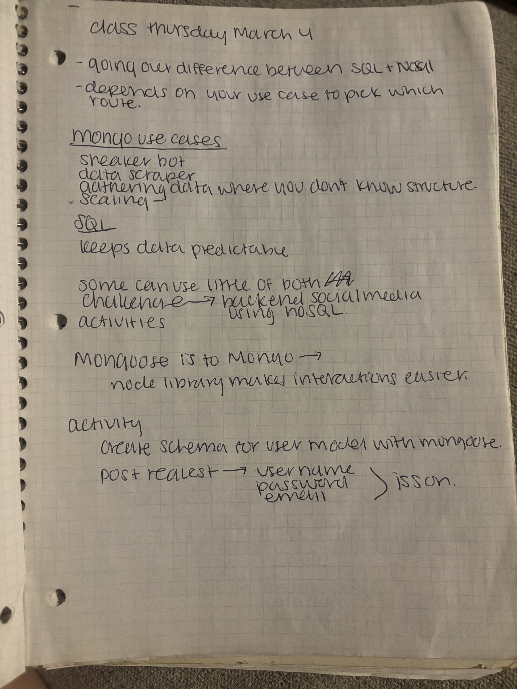
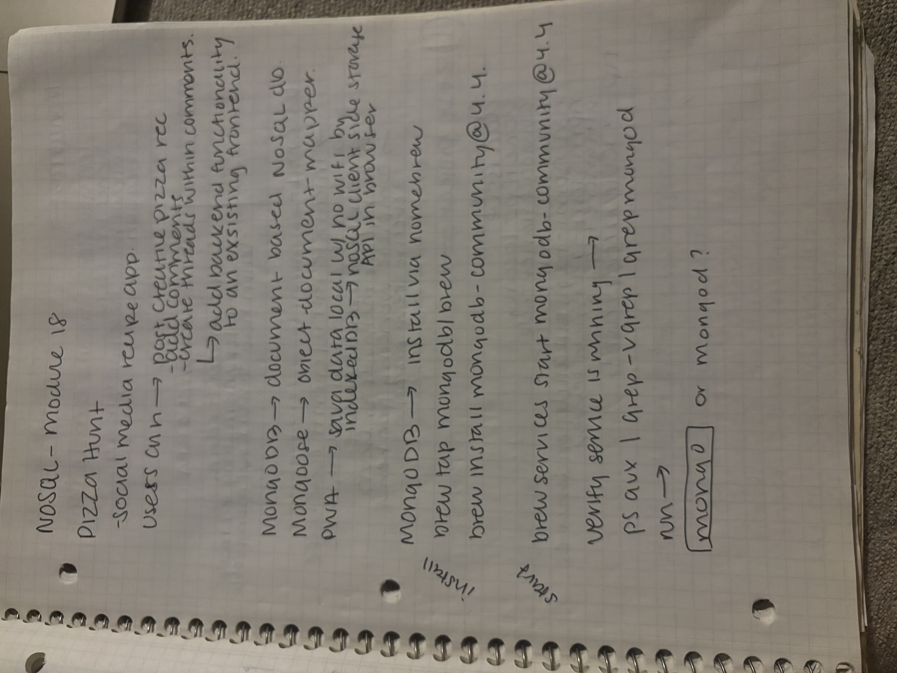
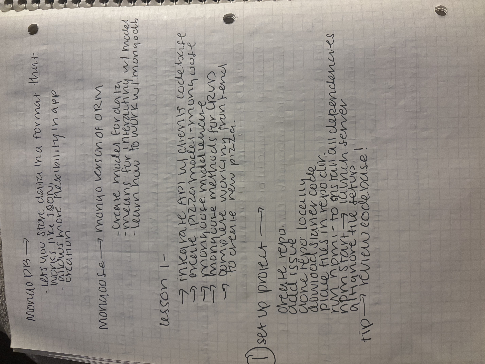
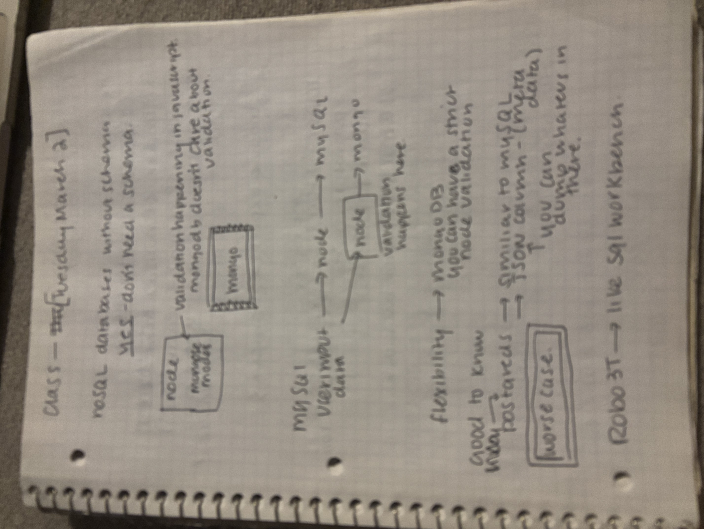

# MongoDB: When Tables Stopped Making Sense — 2020

_The moment I understood why "not everything needs to be normalized"_

---

## Context

**When:** March 2020 (Bootcamp - NoSQL/MongoDB module)
**What I was learning:** MongoDB, NoSQL databases, Mongoose ODM, document-based thinking
**Why it was hard:** After weeks of SQL, foreign keys, and JOIN statements, MongoDB felt backwards. Why would you WANT duplicate data? Why embed instead of normalize? Wasn't redundancy bad?
**Where I was:** Building a pizza ordering app, wrestling with when to use MongoDB vs SQL

**The mental shift:** Letting go of "every piece of data gets exactly one home" and embracing "sometimes you want everything in one place."

---

## The Notes

These 9 pages capture me learning to think in documents instead of tables — comparing SQL to NoSQL, building a pizza app with Mongoose, and finally understanding the tradeoffs.

### Page 1: Class Notes - March 4th (The Breakthrough)

**What's happening here:**
"class thursday march 4"

"giving our difference between SQL + NoSQL depends on how we scale to pick which route."

**MongoDB use cases:**
- Speaker bot - needs to retrieve ALL user data quickly
- Data where you don't know structure
- SQL: "keeps data predictable"
- "some can mix both or pair ZZA"

**What I notice now:**
This was the day it clicked. The key line: **"depends on how we scale."** It's not about one being better — it's about choosing the right tool. SQL scales vertically (bigger servers). MongoDB scales horizontally (more servers). Different problems, different solutions.

The rushed handwriting shows I was trying to capture everything. This was a breakthrough moment.

---

### Page 2: NoSQL - MongoDB Introduction

**What's happening here:**
"NoSQL - MongoDB"
Notes about pizza app, Mongoose, document structure.

**What I notice now:**
I was starting to see the pattern: pizza orders are perfect for documents because you always want the whole order at once (customer, toppings, delivery address). You don't query "show me all pepperoni from all orders" — you query "show me THIS order."

---

### Page 3: MongoDB + Mongoose Setup

**What's happening here:**
Notes on Mongoose models, setup steps, how to connect to MongoDB.

**What I notice now:**
I was relieved to see schemas coming back! Even though MongoDB is "schemaless," Mongoose adds structure. You CAN have validation and types — you're just not locked into rigid tables.

---

### Page 4: MongoDB vs SQL Comparison

**What's happening here:**
"Mongo DB vs SQL"
Side-by-side comparison, notes on when to use each.

**What I notice now:**
I was building my decision framework. Not "which is better" but "when do I reach for which tool?" This comparison thinking shows up in all my technical writing now.

---

### Page 5: SQL vs NoSQL Comparison Table

**What's happening here:**
"Mongo DB vs SQL" - A comparison table with SQL in one column, NoSQL in the other. Notes about "schema" vs "no schema," structured vs flexible.

**What I notice now:**
Making my own comparison chart helped solidify the differences. Not just reading about it, but organizing the tradeoffs visually.

---

### Page 6: CRUD + Mongoose Methods

**What's happening here:**
Notes on Mongoose CRUD operations, methods for creating, reading, updating, deleting documents.

**What I notice now:**
Moving from theory to practice. Learning the actual code patterns for working with MongoDB through Mongoose.

---

### Page 7: Pizza Project CRUD Operations

**What's happening here:**
"Pizza project"
Detailed notes on implementing CRUD for the pizza app.

**What I notice now:**
Applying MongoDB concepts to a real project. The pizza app was where theory became tangible.

---

### Page 8: Pizza Project Planning (Part 2)

**What's happening here:**
Continuation of the pizza project - more detailed planning and implementation notes.

**What I notice now:**
Breaking the project into parts, thinking through the data structure and relationships needed for a real application.

---

### Page 9: NoSQL Process & Database Diagrams

**What's happening here:**
Diagrams comparing database structures - boxes showing how data is organized differently in SQL vs NoSQL. The page says "nosql process" and shows model relationships.

**What I notice now:**
Visual comparison again! I needed to SEE the structural difference between relational tables (normalized, connected by IDs) and document collections (embedded, denormalized). The boxes and arrows made it concrete.

---

## The Aha Moment

**Page 1 — Class notes from March 4th.**

The line that unlocked everything:
> "depends on how we scale to pick which route"

It wasn't about MongoDB being "better" or "worse" than SQL. It was about:
- **SQL** → Complex queries, joins, strict consistency (banking, inventory)
- **MongoDB** → Fast reads, flexible schemas, horizontal scaling (user profiles, content management)

Once I stopped trying to figure out "the right answer" and started thinking "the right tool for this job," MongoDB made sense.

---

## How I'd Explain This Now

**Then (March 2020):**
"MongoDB is a NoSQL database that stores documents instead of rows."

**Now (2025):**
"Think of SQL as filing cabinets with rigid folder templates — every folder must match exactly. MongoDB is like storage bins with labels — each bin can hold different things, as long as they're related.

SQL is perfect when you need strict rules (financial transactions, inventory). MongoDB shines when you need speed and flexibility (user profiles, blog posts, product catalogs).

The best apps use BOTH: SQL for transactions and relationships, MongoDB for flexible content and fast reads. It's not either/or — it's choosing the right tool for each data type."

**The filing cabinet metaphor started here** — in my notebooks, trying to visualize the difference.

---

## What This Taught Me

**Comparison unlocks understanding.**

I couldn't understand MongoDB in isolation. I needed to see it NEXT TO SQL:
- How they handle relationships differently
- When to normalize vs. when to embed
- Tradeoffs between consistency and speed

This pattern drives my documentation now:
- Show the alternative
- Explain the tradeoff
- Give the decision framework
- Don't say "better" — say "better FOR what?"

**Visual thinking reveals structure.**

The diagrams (MVC architecture, data models, embed vs. reference) helped more than words. Drawing the system showed me how pieces connected.

---

## Connection to Today

These bootcamp notes directly informed my [MongoDB Quick Reference](../../mongodb/README.md), where I use the same "filing cabinet vs storage bins" metaphor and explain embed vs. reference with visual examples.

The instinct to ask "WHEN would you use this?" started in these pages.

---

_From March 2020 bootcamp notes - NoSQL/MongoDB module. Part of [The Archives](../README.md)._
