# Mutation Testing with Stryker

_Who tests the tests? Mutants do._

This is my exploration of mutation testing: a technique that injects bugs (mutations) into your code to verify your tests can actually catch them. Stryker is the mutation testing framework that brings this concept to JavaScript and TypeScript.

Part of my Curiosity Documentation series, where I break down tools by learning them from the ground up.

---

## 🧬 What Is Mutation Testing?

**The problem:** Your tests might all pass, but that doesn't mean they're actually testing the right things.

Code coverage tells you which lines your tests execute, but not whether those tests would fail if the code was broken. You could have 100% code coverage with tests that don't catch any bugs.

**Mutation testing solves this** by deliberately breaking your code in small ways (introducing "mutants") and checking if your tests catch the bugs. If a test suite lets a mutant survive, it means you have a gap in your test coverage.

---

## 🧪 The Mutant Metaphor

Stryker uses a brilliant metaphor: **mutants**.

Think of your codebase as the original DNA. Mutation testing creates copies of your code with tiny genetic mutations: changing a `>` to a `>=`, flipping a `true` to `false`, or removing a function call.

Each mutation creates a **mutant** version of your code.

### The Test: Survival vs. Death

1. **Run your tests against the mutant code**
2. **If tests fail** → The mutant is **killed** ✅ (Your tests caught the bug!)
3. **If tests pass** → The mutant **survived** ❌ (Your tests missed the bug!)

**Mutation Score** = (Killed Mutants / Total Mutants) × 100%

A high mutation score means your tests are effective at catching bugs.

---

## 🔬 How Stryker Works

### The Mutation Testing Loop

```mermaid
flowchart TD
    A[Original Code<br/>function isAdult age<br/>return age >= 18] --> B[Stryker Creates Mutants]

    B --> C1[Mutant #1: age > 18]
    B --> C2[Mutant #2: age <= 18]
    B --> C3[Mutant #3: age < 18]
    B --> C4[Mutant #4: return true]
    B --> C5[Mutant #5: return false]

    C1 --> D1[Run Tests]
    C2 --> D2[Run Tests]
    C3 --> D3[Run Tests]
    C4 --> D4[Run Tests]
    C5 --> D5[Run Tests]

    D1 --> E1[✅ Tests FAIL<br/>Killed]
    D2 --> E2[✅ Tests FAIL<br/>Killed]
    D3 --> E3[✅ Tests FAIL<br/>Killed]
    D4 --> E4[✅ Tests FAIL<br/>Killed]
    D5 --> E5[❌ Tests PASS<br/>Survived]

    E1 --> F[Report:<br/>Mutation Score: 80%<br/>4 killed / 5 total<br/>1 survived]
    E2 --> F
    E3 --> F
    E4 --> F
    E5 --> F

    style E1 fill:#d4edda,stroke:#28a745
    style E2 fill:#d4edda,stroke:#28a745
    style E3 fill:#d4edda,stroke:#28a745
    style E4 fill:#d4edda,stroke:#28a745
    style E5 fill:#f8d7da,stroke:#dc3545
    style F fill:#cfe2ff,stroke:#0d6efd
```



---

## 🚀 Getting Started with Stryker

### Installation

```bash
npm install --save-dev @stryker-mutator/core @stryker-mutator/jest-runner
npx stryker init
```

The `init` wizard helps you configure Stryker for your project.

### Basic Configuration

`stryker.conf.json`:
```json
{
  "$schema": "./node_modules/@stryker-mutator/core/schema/stryker-schema.json",
  "packageManager": "npm",
  "testRunner": "jest",
  "coverageAnalysis": "perTest",
  "mutate": [
    "src/**/*.ts",
    "!src/**/*.spec.ts"
  ]
}
```

### Run Mutation Tests

```bash
npx stryker run
```

Stryker will:
1. Scan your code for mutation opportunities
2. Create mutants
3. Run your test suite against each mutant
4. Generate a report showing which mutants survived

---

## 🧬 Types of Mutations

Stryker applies different types of mutations based on the code it finds:

### Arithmetic Operator Mutations
```typescript
// Original
const total = price + tax;

// Mutants
const total = price - tax;  // Mutant: + → -
const total = price * tax;  // Mutant: + → *
const total = price / tax;  // Mutant: + → /
```

### Comparison Operator Mutations
```typescript
// Original
if (age >= 18) { }

// Mutants
if (age > 18) { }   // Mutant: >= → >
if (age <= 18) { }  // Mutant: >= → <=
if (age < 18) { }   // Mutant: >= → <
if (age == 18) { }  // Mutant: >= → ==
```

### Logical Operator Mutations
```typescript
// Original
if (isActive && hasPermission) { }

// Mutants
if (isActive || hasPermission) { }  // Mutant: && → ||
if (isActive) { }                    // Mutant: removed hasPermission
if (hasPermission) { }               // Mutant: removed isActive
```

### Boolean Literal Mutations
```typescript
// Original
const isEnabled = true;

// Mutant
const isEnabled = false;  // Mutant: true → false
```

### Conditional Boundary Mutations
```typescript
// Original
for (let i = 0; i < 10; i++) { }

// Mutants
for (let i = 0; i <= 10; i++) { }  // Mutant: < → <=
for (let i = 1; i < 10; i++) { }   // Mutant: 0 → 1
```

### String Literal Mutations
```typescript
// Original
const greeting = "Hello";

// Mutants
const greeting = "";        // Mutant: "Hello" → ""
const greeting = "Stryker";  // Mutant: changed value
```

### Block Statement Mutations
```typescript
// Original
function greet() {
  console.log("Hello");
}

// Mutant
function greet() {
  // Mutant: removed console.log
}
```

---

## 📊 Understanding the Report

After running Stryker, you'll get a detailed HTML report.

### Mutation Score Metrics

```
All files      | 75.32% | 116/154 | 38 survived
src/utils.ts   | 68.42% |  13/19  | 6 survived
src/auth.ts    | 81.25% |  13/16  | 3 survived
```

**What the numbers mean:**
- **75.32%** = Mutation score (percentage of mutants killed)
- **116/154** = 116 killed out of 154 total mutants
- **38 survived** = Number of mutants that escaped detection

### Mutant Statuses

- **Killed** ✅ — Your tests caught the mutation (good!)
- **Survived** ❌ — Mutation wasn't caught (test gap!)
- **No Coverage** ⚠️ — Code isn't covered by any tests
- **Timeout** ⏱️ — Tests took too long (possible infinite loop)
- **CompileError** 🔨 — Mutant produced invalid syntax
- **RuntimeError** 💥 — Mutant crashed during execution

---

## 🎯 Real-World Example

### Original Code

`discount.ts`:
```typescript
export function calculateDiscount(price: number, isPremium: boolean): number {
  if (price > 100 && isPremium) {
    return price * 0.9;  // 10% discount
  }
  return price;
}
```

### Tests (Before Mutation Testing)

`discount.spec.ts`:
```typescript
describe('calculateDiscount', () => {
  it('should apply discount for premium users with high price', () => {
    expect(calculateDiscount(150, true)).toBe(135);
  });
});
```

### Run Stryker

```bash
npx stryker run
```

### Stryker Report: 3 Survived Mutants ❌

**Survived Mutant #1:**
```diff
- if (price > 100 && isPremium) {
+ if (price >= 100 && isPremium) {
```
Your test only checks `price = 150`, not `price = 100`.

**Survived Mutant #2:**
```diff
- if (price > 100 && isPremium) {
+ if (price > 100 || isPremium) {
```
Your test doesn't verify what happens when only one condition is true.

**Survived Mutant #3:**
```diff
- return price * 0.9;
+ return price * 0.91;
```
Your test hard-codes the expected value, so small changes to the discount rate aren't caught.

### Improved Tests (After Mutation Testing)

```typescript
describe('calculateDiscount', () => {
  it('should apply discount for premium users with price > 100', () => {
    const price = 150;
    const discounted = calculateDiscount(price, true);
    expect(discounted).toBe(price * 0.9);  // Verify formula, not hard-coded value
  });

  it('should NOT apply discount at boundary (price = 100)', () => {
    expect(calculateDiscount(100, true)).toBe(100);  // Catches >= vs >
  });

  it('should NOT apply discount for non-premium users', () => {
    expect(calculateDiscount(150, false)).toBe(150);  // Catches && vs ||
  });

  it('should NOT apply discount for low-price premium users', () => {
    expect(calculateDiscount(50, true)).toBe(50);  // Catches && vs ||
  });
});
```

### New Mutation Score: 100% ✅

All mutants killed. Tests now verify:
- Boundary conditions (`>` vs `>=`)
- Logical operators (`&&` vs `||`)
- The discount formula (not just hard-coded expectations)

---

## 🧠 When to Use Mutation Testing

### Use Mutation Testing When:
✅ You have critical business logic that must be correct
✅ You want to verify test quality, not just code coverage
✅ You're refactoring code and need confidence tests will catch regressions
✅ You're on a small-to-medium codebase (mutation testing is slow on large projects)

### Don't Use Mutation Testing For:
❌ Every single test run (too slow for CI/CD on every commit)
❌ Code with 100% coverage that's already well-tested
❌ Huge codebases (run time explodes with large mutation counts)
❌ Generated code or third-party libraries

---

## ⚙️ Performance Tips

Mutation testing is **computationally expensive**. It runs your test suite once per mutant.

If you have 100 mutants and your test suite takes 10 seconds, mutation testing takes ~16 minutes.

### Speed Up Mutation Testing

**1. Use coverage analysis**
```json
{
  "coverageAnalysis": "perTest"
}
```
Stryker only runs tests that cover the mutated code.

**2. Limit files being mutated**
```json
{
  "mutate": [
    "src/core/**/*.ts",
    "!src/**/*.spec.ts"
  ]
}
```

**3. Exclude low-value code**
Skip mutations on simple getters, constants, or type definitions:
```json
{
  "mutator": {
    "excludedMutations": ["StringLiteral", "ObjectLiteral"]
  }
}
```

**4. Run mutation tests periodically, not on every commit**
- Run full mutation testing weekly or before releases
- Run incremental mutation testing on changed files only in CI

**5. Use incremental mode**
```bash
npx stryker run --incremental
```
Stryker caches results and only re-tests changed code.

---

## 🎯 Mutation Testing vs Code Coverage

| Code Coverage | Mutation Testing |
|---------------|------------------|
| Tells you **which lines** your tests execute | Tells you **if your tests catch bugs** |
| Fast (run tests once) | Slow (run tests per mutant) |
| Easy to game (execute code without assertions) | Hard to game (mutants expose weak tests) |
| Good for finding untested code | Good for finding weak tests |
| Run on every commit | Run periodically or pre-release |

**Best practice:** Use code coverage to find untested code. Use mutation testing to verify test quality.

---

## 🧬 Common Patterns & Gotchas

### Pattern: Ignore Equivalent Mutants

Some mutants are logically equivalent to the original code:

```typescript
// Original
if (x > 0) {
  return x;
} else {
  return 0;
}

// Equivalent Mutant (behaves identically)
if (x > 0) {
  return x;
}
return 0;
```

Mark these as ignored:
```typescript
// Stryker disable next-line all
if (x > 0) {
  return x;
}
return 0;
```

### Gotcha: Accidentally Mutating Test Files

**Problem:** By default, Stryker might try to mutate your test files, not just your source code.

```json
// ❌ Bad - mutates everything
{
  "mutate": ["src/**/*.ts"]
}
```

This creates nonsense mutants like:
```typescript
// Original test
expect(result).toBe(5);

// Mutated test
expect(result).toBe(6);  // Nonsense mutation
```

**Solution:** Explicitly exclude test files:
```json
// ✅ Good
{
  "mutate": [
    "src/**/*.ts",
    "!src/**/*.spec.ts",
    "!src/**/*.test.ts",
    "!src/**/__tests__/**"
  ]
}
```

### Gotcha: Flaky Tests Are Amplified

**Problem:** If you have flaky tests that pass/fail randomly, mutation testing makes it 10x worse.

One flaky test run on 100 mutants = 100 potentially wrong results.

**Symptoms:**
- Mutants randomly switch between "Killed" and "Survived"
- Different mutation scores on each run
- Stryker reports timeouts inconsistently

**Solution:** Fix flaky tests BEFORE running mutation testing.

```bash
# Run your test suite 10 times - it should pass every time
for i in {1..10}; do npm test || exit 1; done
```

### Gotcha: Infinite Loops from Boundary Mutations

**Problem:** Boundary mutations can create infinite loops:

```typescript
// Original
for (let i = 0; i < arr.length; i++) {
  process(arr[i]);
}

// Mutant (infinite loop!)
for (let i = 0; i <= arr.length; i++) {  // Out of bounds
  process(arr[i]);
}
```

**What happens:** Stryker runs until timeout (default: 60 seconds per mutant)

**Solution:** Configure reasonable timeouts:
```json
{
  "timeoutMS": 5000,  // 5 seconds max per test
  "timeoutFactor": 1.5
}
```

### Gotcha: Logging Mutations Are Noise

**Problem:** Stryker mutates logging statements, which rarely provide value:

```typescript
// Original
console.log("User logged in:", userId);

// Mutant
console.log("", userId);  // Survived - logs don't affect tests
```

**Solution:** Exclude mutations on logging:
```json
{
  "mutate": [
    "src/**/*.ts",
    "!src/**/*.spec.ts"
  ],
  "mutator": {
    "excludedMutations": ["StringLiteral"]
  }
}
```

Or ignore specific lines:
```typescript
// Stryker disable next-line all
console.log("Debug info:", data);
```

### Gotcha: Mutating Constants and Config

**Problem:** Stryker mutates constants that should never change:

```typescript
const MAX_RETRIES = 3;
const API_URL = "https://api.example.com";
const TAX_RATE = 0.08;
```

Mutating these creates nonsense scenarios that waste time.

**Solution:** Keep constants in separate files and exclude them:
```json
{
  "mutate": [
    "src/**/*.ts",
    "!src/**/*.spec.ts",
    "!src/constants.ts",
    "!src/config/**"
  ]
}
```

### Gotcha: Type-Only Mutations

**Problem:** TypeScript type annotations get mutated but don't affect runtime:

```typescript
// Original
function greet(name: string): string {
  return `Hello, ${name}`;
}

// Mutant (type change doesn't affect runtime)
function greet(name: number): string {  // TypeScript catches this
  return `Hello, ${name}`;
}
```

**Solution:** This is actually fine! TypeScript compilation will fail, and Stryker marks it as "CompileError" (not counted against your score).

### Gotcha: Static Methods Hide Dependencies

**Problem:** Static methods make dependencies harder to mock, and mutation testing reveals gaps in your test coverage.

**Static utility function example:**
```typescript
// ❌ Static method with hidden dependency
class DateUtils {
  static isExpired(expiryDate: Date): boolean {
    const now = new Date();  // Hidden dependency on system time!
    return expiryDate < now;
  }
}

// Test
test('should detect expired dates', () => {
  const yesterday = new Date(Date.now() - 86400000);
  expect(DateUtils.isExpired(yesterday)).toBe(true);
});
```

**Mutant that survives:**
```typescript
// Mutant: flipped comparison
static isExpired(expiryDate: Date): boolean {
  const now = new Date();
  return expiryDate > now;  // Mutant: < → >
}
```

Your test passes today, but if the test runs tomorrow, it might fail. You can't control `new Date()` in the static method.

**Solution 1: Make it non-static and inject dependencies**
```typescript
// ✅ Better: instance method with injected time
class DateValidator {
  constructor(private getCurrentTime: () => Date = () => new Date()) {}

  isExpired(expiryDate: Date): boolean {
    const now = this.getCurrentTime();
    return expiryDate < now;
  }
}

// Test with full control
test('should detect expired dates', () => {
  const fixedTime = new Date('2024-01-15');
  const validator = new DateValidator(() => fixedTime);

  const expired = new Date('2024-01-14');
  const notExpired = new Date('2024-01-16');

  expect(validator.isExpired(expired)).toBe(true);
  expect(validator.isExpired(notExpired)).toBe(false);
  // Kills all comparison mutants: <, <=, >, >=
});
```

**Solution 2: Pass time as a parameter**
```typescript
// ✅ Also good: pure function
function isExpired(expiryDate: Date, currentTime: Date): boolean {
  return expiryDate < currentTime;
}

// Test
test('should detect expired dates', () => {
  const currentTime = new Date('2024-01-15');
  const expired = new Date('2024-01-14');
  const notExpired = new Date('2024-01-16');

  expect(isExpired(expired, currentTime)).toBe(true);
  expect(isExpired(notExpired, currentTime)).toBe(false);
});
```

### Gotcha: Testing Static Utility Classes Incompletely

**Problem:** Static utility classes often have multiple code paths that mutation testing exposes as untested.

```typescript
class StringUtils {
  static formatName(name: string | null | undefined): string {
    if (!name) return 'Unknown';
    if (name.length > 50) return name.substring(0, 50) + '...';
    return name.trim();
  }
}

// ❌ Incomplete test
test('formats name', () => {
  expect(StringUtils.formatName('Alex')).toBe('Alex');
});
```

**Survived mutants:**
```typescript
// Mutant 1: Changed ! to empty check
if (name) return 'Unknown';  // Survives - never tested null/undefined

// Mutant 2: Changed > to >=
if (name.length >= 50) return name.substring(0, 50) + '...';  // Survives

// Mutant 3: Changed substring bound
return name.substring(0, 51) + '...';  // Survives

// Mutant 4: Changed trim() to something else
return name;  // Might survive if input has no whitespace
```

**Solution: Test all branches**
```typescript
// ✅ Complete tests
describe('StringUtils.formatName', () => {
  test('returns "Unknown" for null', () => {
    expect(StringUtils.formatName(null)).toBe('Unknown');
  });

  test('returns "Unknown" for undefined', () => {
    expect(StringUtils.formatName(undefined)).toBe('Unknown');
  });

  test('returns "Unknown" for empty string', () => {
    expect(StringUtils.formatName('')).toBe('Unknown');
  });

  test('trims whitespace from normal names', () => {
    expect(StringUtils.formatName('  Alex  ')).toBe('Alex');
  });

  test('truncates names longer than 50 characters', () => {
    const longName = 'A'.repeat(60);
    expect(StringUtils.formatName(longName)).toBe('A'.repeat(50) + '...');
  });

  test('does not truncate names exactly 50 characters', () => {
    const exactName = 'A'.repeat(50);
    expect(StringUtils.formatName(exactName)).toBe(exactName);
  });

  test('does not truncate names under 50 characters', () => {
    expect(StringUtils.formatName('Short name')).toBe('Short name');
  });
});
```

### Gotcha: Mocking Static Methods Is Painful

**Problem:** You can't easily mock static methods when they're called from other code, leading to survived mutants.

```typescript
// Static method with external dependency
class Logger {
  static log(message: string): void {
    console.log(`[${new Date().toISOString()}] ${message}`);
  }
}

class UserService {
  static createUser(name: string): User {
    Logger.log(`Creating user: ${name}`);  // Can't easily mock this
    return { id: generateId(), name };
  }
}

// Test
test('creates user', () => {
  const user = UserService.createUser('Alex');
  expect(user.name).toBe('Alex');
  // Logger.log was called, but we didn't verify it
});
```

**Survived mutant:**
```typescript
// Mutant: removed logging call
static createUser(name: string): User {
  // Logger.log() removed by mutant
  return { id: generateId(), name };
}
```

Test passes! Logging mutant survived because we never verified it was called.

**Solution: Use dependency injection**
```typescript
// ✅ Better: inject logger
interface ILogger {
  log(message: string): void;
}

class UserService {
  constructor(private logger: ILogger) {}

  createUser(name: string): User {
    this.logger.log(`Creating user: ${name}`);
    return { id: generateId(), name };
  }
}

// Test
test('creates user and logs', () => {
  const mockLogger = { log: jest.fn() };
  const service = new UserService(mockLogger);

  const user = service.createUser('Alex');

  expect(user.name).toBe('Alex');
  expect(mockLogger.log).toHaveBeenCalledWith('Creating user: Alex');
  // Kills the "remove function call" mutant
});
```

### Gotcha: Testing Implementation Instead of Behavior

**Problem:** Mutation testing exposes when tests are too tightly coupled to implementation:

```typescript
// Code
function processUser(user) {
  const normalized = user.name.toLowerCase();
  return normalized;
}

// ❌ Bad test (tests implementation)
test('should call toLowerCase', () => {
  const spy = jest.spyOn(String.prototype, 'toLowerCase');
  processUser({ name: 'ALEX' });
  expect(spy).toHaveBeenCalled();  // Survives mutations to the logic
});

// ✅ Good test (tests behavior)
test('should normalize user name to lowercase', () => {
  expect(processUser({ name: 'ALEX' })).toBe('alex');  // Kills mutations
});
```

Mutation testing reveals these weak tests by showing mutants survive despite passing tests.

### Gotcha: High Mutation Score ≠ Perfect Tests

A 100% mutation score means your tests catch all the mutations Stryker tried.

It doesn't mean:
- Your tests cover all edge cases
- Your tests verify the right business logic
- Your code is bug-free
- You've tested integration points
- Your error handling is robust

**Example:**
```typescript
function divide(a: number, b: number): number {
  return a / b;  // Missing validation!
}

test('divides correctly', () => {
  expect(divide(10, 2)).toBe(5);  // 100% mutation score
});
```

Mutants are killed, but you never test `divide(10, 0)` (division by zero).

Mutation testing improves test quality, but it's not a silver bullet.

### Gotcha: Cost on CI/CD Pipelines

**Problem:** Running mutation tests on every commit destroys your CI/CD pipeline performance.

**Impact:**
- 100 mutants × 10-second test suite = 16+ minutes
- Blocks other developers waiting for CI
- Burns CI credits on hosted platforms

**Solution:** Run mutation testing selectively:

```yaml
# GitHub Actions example
name: Mutation Testing

on:
  schedule:
    - cron: '0 2 * * 1'  # Weekly on Mondays at 2am
  workflow_dispatch:      # Manual trigger
  pull_request:
    paths:
      - 'src/core/**'     # Only on critical code changes

jobs:
  mutation:
    runs-on: ubuntu-latest
    steps:
      - uses: actions/checkout@v3
      - run: npx stryker run --incremental
```

### Gotcha: Survived Mutants Aren't Always Bad

**Problem:** Some survived mutants are actually acceptable.

**Example 1: Defensive programming**
```typescript
// Original
function getUser(id: string | null) {
  if (!id) return null;
  return db.findUser(id);
}

// Survived mutant
function getUser(id: string | null) {
  if (id) return null;  // Mutant survives but logic is clearly wrong
  return db.findUser(id);
}
```

If your tests never call `getUser(null)`, the mutant survives. But maybe that's fine if the calling code always validates IDs.

**Example 2: Error messages**
```typescript
// Original
throw new Error("User not found");

// Survived mutant
throw new Error("");  // String mutated to empty
```

Tests catch that an error is thrown, but don't verify the message. That might be okay depending on your requirements.

**Guideline:** Not every survived mutant needs a test. Ask: "Would this bug matter in production?"

### Pattern: Start Small

Don't try to mutation test your entire codebase at once.

1. Start with critical modules (auth, payments, core business logic)
2. Set a baseline mutation score (e.g., 70%)
3. Gradually improve coverage
4. Expand to more files over time

### Pattern: Use Incremental Mode in CI

```bash
# First run: full mutation testing
npx stryker run

# Subsequent runs: only test changed code
npx stryker run --incremental
```

Stryker caches results in `.stryker-tmp/` and only re-tests modified mutants.

---

## 🧠 Key Takeaways

**What mutation testing taught me:**

1. **Code coverage is necessary but not sufficient**. You can have 100% coverage and still miss bugs. Mutation testing reveals gaps.

2. **Tests should verify behavior, not implementation**. Hard-coded expectations let mutants survive. Test formulas and logic, not specific values.

3. **Boundary conditions matter**. Most survived mutants involve `>` vs `>=`, `&&` vs `||`, or off-by-one errors.

4. **Mutation testing is a diagnostic tool**. Use it to find weak tests, not as a daily CI check.

5. **Perfect mutation scores aren't the goal**. Aim for high scores on critical code. Accept lower scores on trivial code.

---

## 📚 Resources

**Official Docs:**
- [Stryker Mutator](https://stryker-mutator.io/) — Main documentation
- [Mutation Testing Overview](https://stryker-mutator.io/docs/mutation-testing-elements/introduction/) — Concepts explained

**Further Reading:**
- [Mutation Testing: A Tale of Two Suites](https://medium.com/@kentcdodds/write-tests-not-too-many-mostly-integration-5e8c7fff591c) — Kent C. Dodds on test quality

---

_Who tests the tests? Now you do, with mutants._ 🌭

← [Back to Home](../../README.md) | [Jest](../jest/README.md) | [Code Coverage](../code-coverage/README.md)
